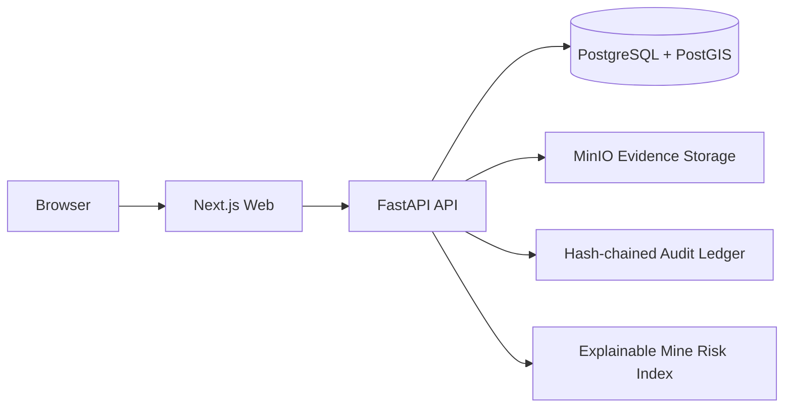

# Surang Saathi

**Surang Saathi** is a Smart India Hackathon 2026 prototype for mine-safety governance: hazard reporting, verified field evidence, corrective-action accountability, explainable mine risk, and tamper-evident auditability.

> **Prototype notice:** Surang Saathi is a student project created for Smart India Hackathon 2026. It is not an official Government of India, Ministry of Coal, Coal India, or DGMS service and does not imply government endorsement.

## What the MVP demonstrates

Surang Saathi connects the operational safety workflow end to end:

```text
Hazard reported
      ↓
Evidence + GPS captured
      ↓
SHA-256 integrity verification
      ↓
PostGIS geofence validation
      ↓
Manager review / escalation
      ↓
Corrective action
      ↓
Resolution
      ↓
Explainable Mine Risk Index
      ↓
Hash-chained audit ledger
```

The current web MVP includes:

- Public Surang Saathi information portal
- Mine management dashboard
- Hazard register and hazard detail
- Manager acknowledgement, review, and escalation workflow
- Corrective-action creation, update, and resolution
- Evidence upload with SHA-256 verification
- Server-side PostGIS geofence validation
- Sync/geofence conflict visibility
- Explainable rule-based Mine Risk Index
- Tamper-evident hash-chained audit ledger and integrity verification
- English-first UI with Hindi available only when explicitly selected

## Repository structure

```text
surang-saathi-dev/
├── apps/
│   ├── web/                 # Next.js + TypeScript management web
│   └── api/                 # FastAPI backend
├── docs/
│   └── api/
│       └── openapi.json     # Frozen Golden Workflow API contract
├── scripts/
│   ├── demo-setup.cmd       # One-command Windows demo setup
│   └── demo-setup.sh        # One-command macOS/Linux demo setup
├── docker-compose.yml       # FastAPI + PostgreSQL/PostGIS + MinIO
├── package.json
└── README.md
```

## Architecture



The browser does not need to call FastAPI directly. The Next.js server uses `API_BASE_URL` to communicate with the backend.

---

# Quick start

## Prerequisites

Install:

- Git
- Docker Desktop
- Node.js 20 or newer
- npm

For Windows, Docker Desktop must be running with the Linux container engine.

## 1. Clone

```bash
git clone https://github.com/anirva09/surang-saathi-dev.git
cd surang-saathi-dev
```

## 2. Start the complete demo environment

### Windows CMD

```cmd
scripts\demo-setup.cmd
```

### macOS / Linux

```bash
chmod +x scripts/demo-setup.sh
./scripts/demo-setup.sh
```

The setup script:

1. checks Docker
2. creates `.env` from `.env.example` when needed
3. builds and starts PostgreSQL/PostGIS, MinIO, and FastAPI
4. handles the first-run PostgreSQL/PostGIS restart race
5. waits for the API
6. loads the deterministic SIH demonstration data
7. creates `apps/web/.env.local` from its example when needed
8. installs frontend dependencies with `npm ci`
9. verifies backend readiness

## 3. Start the web application

```bash
npm run dev
```

Open:

**http://localhost:3000**

---

# Manual setup

Use this section if you prefer not to use the setup script.

## Backend environment

Windows CMD:

```cmd
copy .env.example .env
```

macOS / Linux:

```bash
cp .env.example .env
```

## Start backend services

```bash
docker compose up -d --build
```

On the first creation of the PostgreSQL/PostGIS volume, the database image may briefly restart while PostGIS is initialized. If the API exited during that window:

```bash
docker compose start api
```

Check services:

```bash
docker compose ps
```

## Verify FastAPI

```bash
curl http://localhost:8000/health
```

Expected:

```json
{"status":"ok","service":"surang-saathi-api"}
```

Then:

```bash
curl http://localhost:8000/ready
```

Expected:

```json
{"status":"ready","database":"ok","objectStorage":"ok"}
```

## Load deterministic SIH demo data

```bash
docker compose exec -T api python -m app.seed.run
```

The default prototype scope uses:

| Item | Demo value |
|---|---|
| Organisation | Coal India Limited — SIH Prototype |
| Area | Jharia Area |
| Mine | Demo Mine 03 |
| Mine ID | `MINE-03` |
| Prototype actor | `USR-MSHARMA` |
| Manager | M. Sharma |

## Frontend environment

Windows CMD:

```cmd
copy apps\web\.env.example apps\web\.env.local
```

macOS / Linux:

```bash
cp apps/web/.env.example apps/web/.env.local
```

Default local values:

```env
API_BASE_URL=http://localhost:8000
DEMO_MINE_ID=MINE-03
PROTOTYPE_ACTOR_ID=USR-MSHARMA
API_TIMEOUT_MS=8000
A11Y_PORT=3010
```

Install frontend dependencies:

```bash
npm ci
```

Start Next.js:

```bash
npm run dev
```

---

# Local URLs

| Component | URL |
|---|---|
| Public portal | http://localhost:3000 |
| Safety dashboard | http://localhost:3000/dashboard |
| Hazard register | http://localhost:3000/hazards |
| Mine Risk Index | http://localhost:3000/risk |
| Audit ledger | http://localhost:3000/audit |
| FastAPI | http://localhost:8000 |
| FastAPI Swagger UI | http://localhost:8000/docs |
| FastAPI readiness | http://localhost:8000/ready |
| MinIO Console | http://localhost:9001 |
| PostgreSQL host port | `55432` |

---

# Suggested SIH demo flow

Start from the public portal and follow the Golden Workflow:

1. Open the homepage.
2. Select **Login to Portal**.
3. Review **Demo Mine 03** on the management dashboard.
4. Open the **Hazards** register.
5. Open hazard `HZRD-2026-442` — *Roof support damage observed*.
6. Review its evidence integrity, GPS/geofence status, ownership, and lifecycle.
7. Perform a manager action supported by the current state.
8. Review or manage the corrective action.
9. Open **Mine Risk** and inspect why the current score is high.
10. Open **Audit Ledger** and verify ledger integrity.

## Mine Risk Index

The MVP uses an **explainable rule-based** Mine Risk Index rather than opaque machine learning on compliance screens.

The score is designed to show both the overall risk and the factors contributing to it.

## Evidence integrity

Evidence handling includes:

- MinIO object storage
- SHA-256 server-side hashing
- optional client-hash comparison
- PostGIS server-side geofence verification
- local/server geofence conflict detection
- auditable workflow mutations

## Auditability

Workflow mutations append events to a PostgreSQL-backed hash chain. The ledger can be verified to detect the first broken sequence.

**No blockchain is used.**

---

# Verification

## Frontend

```bash
npm run test
```

```bash
npm run typecheck
```

```bash
npm run lint
```

```bash
npm run build
```

```bash
npm run a11y
```

Frontend integration tests intentionally distinguish between:

- API available
- API unavailable

The UI must not silently substitute mock operational data when the backend is unavailable.

## Backend

Backend tests live under:

```text
apps/api/tests/
```

The backend includes unit and integration coverage for health/readiness, configuration, domain enums/models, deterministic seed behavior, read APIs, workflow mutations, evidence verification, audit integrity, risk calculation, and integration hardening.

---

# API contract

The frozen frontend/backend integration contract is:

```text
docs/api/openapi.json
```

FastAPI/Pydantic is authoritative for public API shapes.

Frontend API DTOs and adapters should follow this contract rather than changing the backend to match old UI mock objects.

---

# Design principles

Surang Saathi is intentionally designed as a serious government/public-sector operational product rather than a generic SaaS dashboard.

The interface prioritizes:

1. mine-worker usability
2. government authenticity
3. SIH feasibility
4. consistency
5. visual polish

Operational screens emphasize:

- what is unsafe
- what is overdue
- who owns the issue
- what requires action now
- whether evidence can be trusted
- why mine risk is high
- whether the audit history is intact

---

# Prototype limitations

The current SIH MVP is not a production deployment.

Not yet implemented as production capabilities:

- real authentication / OIDC / government SSO
- production RBAC and mine/area access scoping
- production user administration
- Flutter offline field application
- live sensor or gas telemetry ingestion
- production notification/escalation infrastructure
- production high availability and disaster recovery
- enterprise monitoring/observability stack
- formal government security accreditation or deployment approval

These are intentionally treated as pilot/production hardening work rather than being presented as already complete.

---

# Troubleshooting

### The web UI says the Safety API cannot be reached

Check Docker:

```bash
docker compose ps
```

Then:

```bash
curl http://localhost:8000/health
```

If the API container exited during a fresh PostgreSQL initialization:

```bash
docker compose start api
```

### The UI says `Mine not found`

Load the deterministic demo seed:

```bash
docker compose exec -T api python -m app.seed.run
```

Then reload the page.

### `/ready` reports an object-storage problem

Check MinIO:

```bash
docker compose ps
```

and inspect API/MinIO logs:

```bash
docker compose logs api --tail=100
```

```bash
docker compose logs minio --tail=100
```

### Reset the entire local demo database

Only do this if you intentionally want to erase local PostgreSQL and MinIO volumes:

```bash
docker compose down -v
```

Then run the demo setup again.

---

# Stopping the project

Stop Next.js with `Ctrl+C`.

Stop Docker services:

```bash
docker compose down
```

Do **not** use `docker compose down -v` unless you intentionally want to delete local demo data.

---

# Technology stack

**Web**
- Next.js
- React
- TypeScript
- Tailwind CSS
- Playwright
- Vitest

**API**
- FastAPI
- Python 3.12
- Pydantic
- SQLAlchemy
- Alembic

**Data & evidence**
- PostgreSQL
- PostGIS
- MinIO
- SHA-256 evidence integrity

**Governance**
- explainable rule-based Mine Risk Index
- hash-chained audit ledger
- deterministic SIH demonstration data

---

## Surang Saathi

**Safer mines. Stronger accountability.**

Built as a Smart India Hackathon 2026 student prototype.
